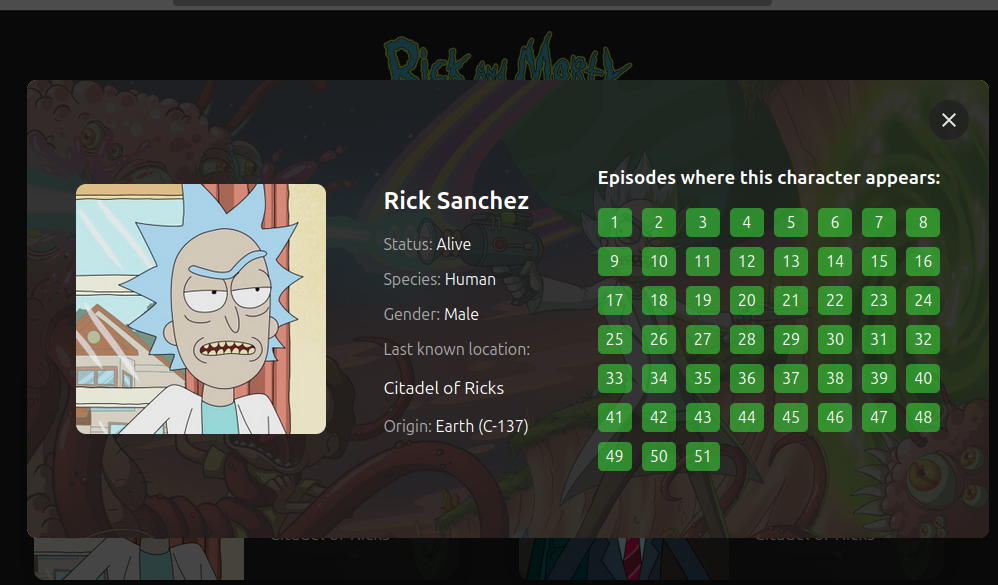

# Rick And Morty With React
A simple website built with React that consumes the https://rickandmortyapi.com/ API, with the purpose of reinforcing React knowledge, such as hooks, components and data fetching.



### Run
```
npm install
```
```
npm run dev
```